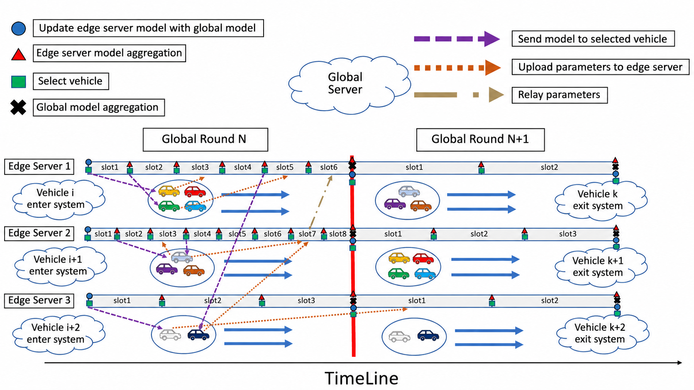

# Hierarchical Federated Learning for the Internet of Vehicle System with Semi-Synchronous Model Aggregation

This repository contains the simulation code for a hierarchical federated learning framework designed for an Internet of Vehicles (IoV) environment with semi-synchronous model aggregation.

SUMO is used to simulate realistic vehicular mobility in a Manhattan-style grid road network. Vehicles are randomly generated at different entry points of the road network, travel through the simulated environment, and leave the system through randomly assigned exit points. During the simulation, geographically distributed edge servers monitor vehicles within their respective coverage areas and randomly select eligible vehicles to participate in local model training.

Once selected by an edge server, a vehicle performs local training using its assigned dataset while continuing to travel through the road network. After completing its local training, the vehicle uploads the trained local model to the edge server that originally selected it. The edge server then aggregates the received vehicle models during its local aggregation intervals and periodically uploads the aggregated edge model to the global server for global model aggregation.

PyTorch is used for model training and hierarchical model aggregation, while SUMO and TraCI are used to simulate and interact with vehicle mobility.

## System Workflow

The overall semi-synchronous hierarchical federated learning process is illustrated below.

<p align="center">
  
</p>

## Project Structure

``` text
hierarchical-fl-iov-semi-sync/
├── README.md
├── environment.yml
├── .gitignore
│
├── src/
│   ├── __init__.py
│   ├── global_clock.py
│   ├── global_server.py
│   ├── edge_server.py
│   ├── trainer.py
│   ├── train_utils.py
│   ├── simulation_thread.py
│   └── edge_server_init.py
│
├── models/
│   └── resnet.py
│
├── scripts/
│   ├── run_simulation.py
│   ├── generate_sumo_grid.py
│   ├── prepare_cifar_noniid.py
│   ├── mix_cifar_groups.py
│   ├── check_gpu.py
│   └── check_dataset.py
│
└── configs/
    └── sumo/
        ├── grid7x7.edg.xml
        ├── grid7x7.net.xml
        ├── grid7x7.nod.xml
        ├── grid7x7.rou.xml
        └── grid7x7.sumocfg
```

Generated datasets and runtime logs are intentionally not committed to the repository. Users may select their own datasets and define the data partitioning strategy according to their experimental requirements. The dataset preparation scripts provided in this repository demonstrate the data partitioning scheme used in the current experiment.

## Environment Setup

The project uses Conda for environment management. The tested
environment is defined in `environment.yml`.

Create the environment:

``` powershell
conda env create -f environment.yml
```

Activate it:

``` powershell
conda activate sumo
```

The environment includes the main Python dependencies used by the
project, including PyTorch, torchvision, NumPy, scikit-learn,
TraCI, and SUMO-related Python packages.

A CUDA-capable environment is expected by the current training code
because the model and training routines use `device='cuda'` by default.

## SUMO

SUMO must be installed separately and its executable must be available
from the command line.

The main simulation script uses:

``` python
SUMO_BINARY = "sumo"
```

You can verify the installation with:

``` powershell
sumo --version
```

The SUMO configuration used by the simulation is:

``` text
configs/sumo/grid7x7.sumocfg
```

## Dataset Preparation

### Dataset design

The dataset preparation code uses the CIFAR-10 Python batches:

``` text
data/cifar-10-batches-py/
```

The current experiment uses only CIFAR-10 labels `0` through `8`. Label
`9` is excluded.

The nine groups are:

| Group | Label | CIFAR-10 Class |
|------:|------:|----------------|
| g0 | 0 | airplane |
| g1 | 1 | automobile |
| g2 | 2 | bird |
| g3 | 3 | cat |
| g4 | 4 | deer |
| g5 | 5 | dog |
| g6 | 6 | frog |
| g7 | 7 | horse |
| g8 | 8 | ship |

Each group therefore contains samples from a single class. This produces
a strongly label-based Non-IID data distribution.

For each group, the data is split using:

``` text
80% training data
20% testing data
```

The project does not use the original CIFAR-10 `test_batch` for this
evaluation split. Instead, `data_batch_1` through `data_batch_5` are
combined and then independently split into training and testing subsets
for each group.

### Generated files

The dataset preparation script generates files in the following form:

``` text
g0_train.pkl
g0_test.pkl
g1_train.pkl
g1_test.pkl
...
g8_train.pkl
g8_test.pkl
```

### Important dataset path requirement

The simulation currently expects the final dataset files under:

``` text
hierarchical-fl-iov-semi-sync/
└── cifar_non_iid/
    ├── g0_train.pkl
    ├── g0_test.pkl
    ├── g1_train.pkl
    ├── g1_test.pkl
    ├── ...
    ├── g8_train.pkl
    └── g8_test.pkl
```

This is because `scripts/run_simulation.py` uses:

``` python
DATA_PATH = ROOT_DIR / "cifar_non_iid"
```

The dataset preparation script may generate its output under a
differently named directory. Before running the simulation, make sure
the generated `g0`--`g8` train/test pickle files are placed in
`cifar_non_iid/`.

The code itself does not need to be modified if this directory structure
is followed.

## Vehicle Training Data Assignment

At runtime, each newly detected vehicle is randomly assigned one data
group from `g0` through `g8`.

For example:

``` text
Vehicle A → g4 → label 4 training data
Vehicle B → g1 → label 1 training data
Vehicle C → g7 → label 7 training data
```


When a `VehicleTrainer` begins training, the selected dataset is
converted into PyTorch tensors. Training batches are then transferred to
the configured device.

## Model

The active model is defined in:

``` text
models/resnet.py
```

The simulation creates it using:

``` python
SmallResNet(num_classes=9)
```

The active network is an 18-layer SmallResNet / ResNet-18-style architecture composed of an initial convolution, four stages containing two residual `BasicBlock`s each, adaptive average pooling, and a final fully connected classifier. 

The network depth and model complexity can be adjusted according to the available computational resources and experimental requirements. For example, a smaller ResNet architecture may be used in resource-constrained environments, while a deeper architecture can be adopted when more computational resources are available.


The model outputs raw logits. `CrossEntropyLoss` is used during
training.

## Simulation Architecture

### Global Clock

`src/global_clock.py` provides a shared logical clock. It runs in a
daemon thread and increments its counter approximately once per
wall-clock second.

The GlobalClock is separate from SUMO's own simulation state and is used
by the training components for timing and logging.

### Simulation Thread

`src/simulation_thread.py` advances SUMO through:

``` python
traci.simulationStep()
```

After a successful simulation step, it signals the main thread through a
`threading.Event`.

The main thread waits for this signal before checking the current
vehicle list and updating the active vehicle registry.

### Edge Servers

The experiment creates nine edge servers:

``` text
Edge0
Edge1
...
Edge8
```

Each EdgeServer is assigned a hard-coded set of covered SUMO edges.

An EdgeServer checks vehicles in its covered area and starts a
`VehicleTrainer` for eligible vehicles.

The configured timing for the current experiment is:

```text
Global interval: 120 GlobalClock units
Edge waiting time: 40 GlobalClock units
Slots per global interval: 3
```

These timing parameters represent the configuration used in the current experiment and can be adjusted according to different experimental requirements. In particular, the global aggregation interval and edge aggregation interval can be modified to evaluate different synchronization frequencies and aggregation behaviors.


Conceptually:

``` text
0              40              80             120
|---------------|---------------|---------------|
    Edge slot 1     Edge slot 2     Edge slot 3
|-----------------------------------------------|
              Global interval
```

### Vehicle Local Training

Each `VehicleTrainer` creates its own model initialized from its edge server's model.

The currently configured local training parameters are:

| Parameter | Value |
|---|---:|
| Maximum epochs | 90 |
| Batch size | 32 |
| Learning rate | 0.005 |
| Loss threshold | 0.01 |
| Optimizer | Adam |
| Loss function | CrossEntropyLoss |

Vehicle local training continues until either the predefined loss threshold is satisfied or the vehicle is about to leave the simulation environment. If a vehicle leaves the system before reaching the loss threshold, its local training is terminated early. The resulting local model is then uploaded to the edge server that originally selected the vehicle for training.


The position condition in the current implementation refers to route
completion/departure behavior; it does not mean that the vehicle has
merely left the coverage area of the EdgeServer that selected it.

### Edge Server Aggregation

Vehicle models uploaded to an EdgeServer are aggregated using a
staleness-aware weighting mechanism.


In the proposed semi-synchronous aggregation mechanism, the local models received from vehicles are aggregated at the edge server according to their model staleness. For vehicle $m$, the staleness factor is defined as:

$$
\beta_m = \frac{1}{1+\delta(k_e-i)}
$$

where $k_e$ represents the current model update index of edge server $e$, $i$ represents the edge model version used by the vehicle when local training started, and $\delta$ is the staleness coefficient.

In the current implementation, the staleness coefficient is set to $\delta=1$. The staleness-based weights of the received vehicle models are normalized before model aggregation.


The weights are normalized before model parameters are aggregated.

Floating-point tensors in the model state are averaged according to
these weights. Non-floating state entries use the value from the first
selected model.

### Global Server Aggregation

After completing the configured number of edge server aggregation rounds, each edge server uploads its latest aggregated model to the global server.

The global server collects the aggregated models from all edge servers and performs global model aggregation. Once the global aggregation is completed, the updated global model is distributed back to the edge servers for the next training round.

Global server aggregation uses the uploaded EdgeServer version values as
weights:

The aggregation weight of edge server $e$ is defined as:

$$
q_e = \frac{K_e}{\sum_{e \in E} K_e}
$$

where $K_e$ represents the number of model updates performed by edge server $e$ during the current global aggregation interval, and $E$ represents the set of participating edge servers. An edge server with a larger $K_e$ is therefore assigned a higher aggregation weight.


After aggregation, the resulting Global model is evaluated and the
Global model version is incremented. EdgeServers then synchronize with
the updated Global model before continuing.


## **Running the Simulation**

From the repository root, first activate the environment:

```powershell
conda activate sumo
```

Confirm that the required dataset files exist:

```text
cifar_non_iid/g0_train.pkl
cifar_non_iid/g0_test.pkl
...
cifar_non_iid/g8_train.pkl
cifar_non_iid/g8_test.pkl
```

Then run:

```powershell
python scripts/run_simulation.py
```

